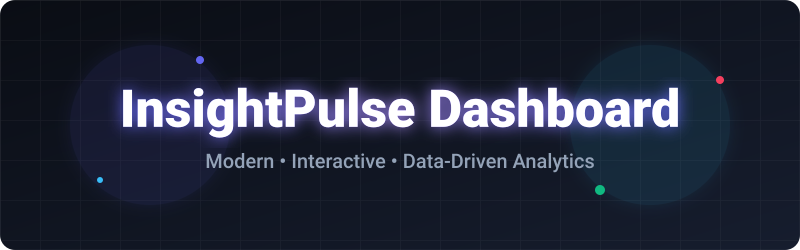
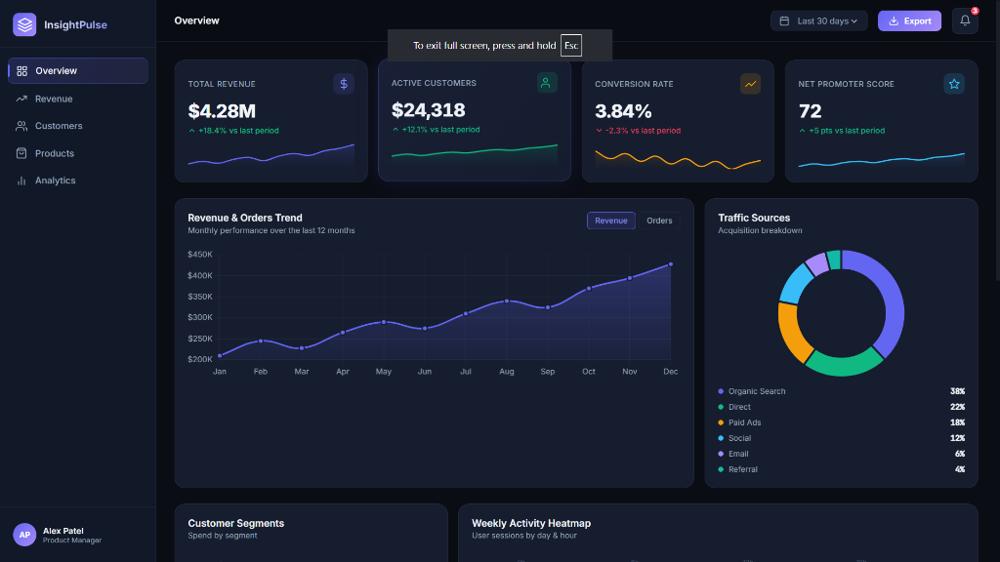
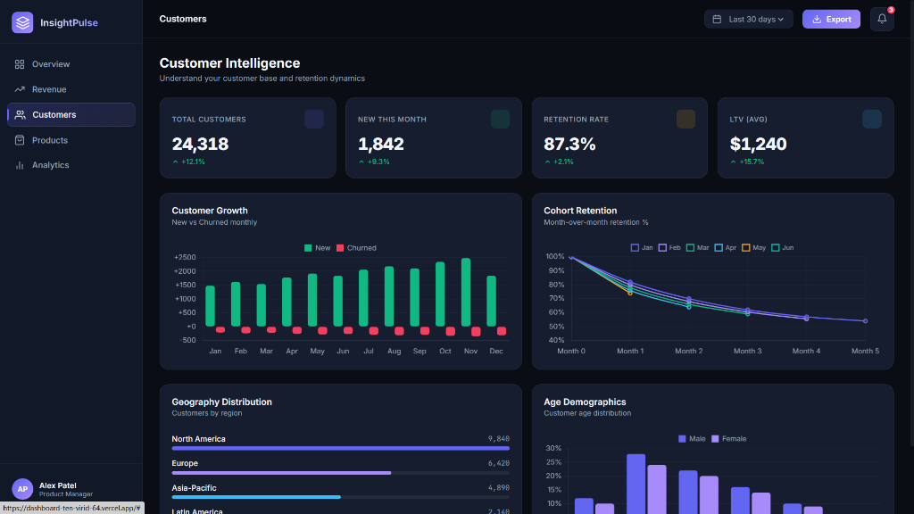
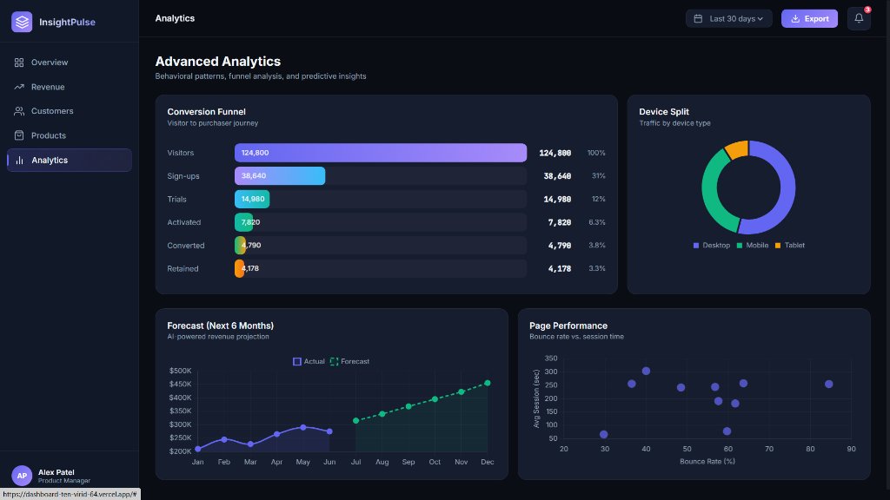
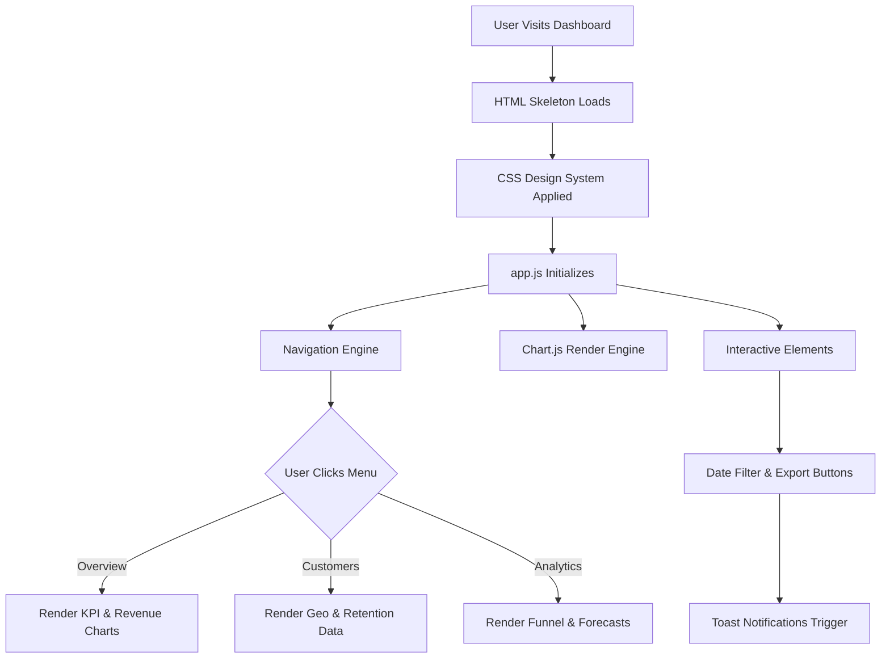

<div align="center">
  

  <h1>InsightPulse Executive Dashboard</h1>
  <p><strong>A Modern, Interactive, Data-Driven Analytics Dashboard</strong></p>

  [](https://dashboard-ten-virid-64.vercel.app/)
  [](https://github.com/prateekvijay265/Dashboard-TST)

</div>

<br>

## 🌟 Overview

**InsightPulse** is a beautiful, fully responsive executive dashboard designed for modern business analytics. Built with performance and usability in mind, it visualizes complex metrics through an intuitive interface, leveraging glass-morphism aesthetics, fluid animations, and real-time interactive charts.

---

## 📸 Platform Screenshots

<div align="center">
  <h3>📊 Overview Page</h3>
  
  <br><br>
  
  <h3>👥 Customers Intelligence</h3>
  
  <br><br>
  
  <h3>📈 Advanced Analytics</h3>
  
</div>

---

## 🛠️ How It Works (Architecture & Data Flow)

The dashboard uses a monolithic frontend approach powered by vanilla HTML/CSS/JS and `Chart.js` for data visualization. Here is how the user interacts with the app:



### 🧩 Core Components
1. **Navigation Engine (`app.js`)**: A custom-built Vanilla JS router handles page transitions smoothly without reloading the browser. It implements lazy-loading for charts (charts are only instantiated when a user visits that specific page).
2. **Design Tokens (`styles.css`)**: Built entirely on custom CSS properties (`:root`), it maintains a scalable glass-morphic dark theme (`--bg-card`, `--accent`, `--border`).
3. **Data Visualization (`Chart.js`)**: Customized chart instances with complex gradient fills, custom tooltips, and interactive legends.

---

## 🚀 Features by Page

| Page | Key Features | Visualizations |
|------|-------------|----------------|
| **Overview** | High-level metrics, activity heatmap, top transactions. | Animated KPIs, Revenue/Orders Line Chart, Heatmap Grid. |
| **Revenue** | Deep dive into revenue streams. | Channel Bar Chart, Doughnut Split, YoY Quarterly Growth. |
| **Customers** | Demographic & Retention insights. | Cohort Retention Line Chart, Geo Distribution Bars. |
| **Products** | Inventory tracking & product rankings. | Category Bar Chart, Top 10 Dynamic Table. |
| **Analytics** | Forecasts and behavioral patterns. | Conversion Funnel, AI Forecast Chart, Scatter Plot. |

---

## ⚙️ Local Development

Want to run this locally? It's as simple as:

1. **Clone the repo:**
   ```bash
   git clone https://github.com/prateekvijay265/Dashboard-TST.git
   ```
2. **Navigate into the directory:**
   ```bash
   cd Dashboard-TST
   ```
3. **Run a local server** (e.g., using Python, VS Code Live Server, or Node):
   ```bash
   npx serve .
   # OR
   python -m http.server 8000
   ```
4. **Open in browser:** Visit `http://localhost:8000`

---

<div align="center">
  <p>Built with ❤️ for elegant data visualization.</p>
</div>
